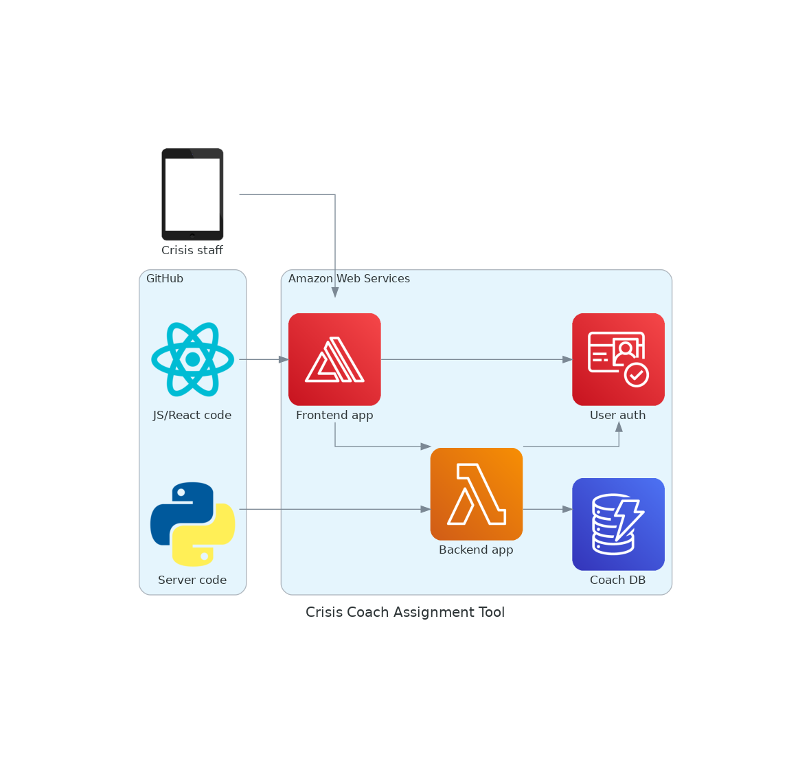

# Developers

This page contains documentation aimed at developers contributing to the project, and any notes which previous developers have made along the way.

## Contents

[App Design](#app-design)

[Front End](#front-end)

[Back End](#back-end)

[Database](#database)

[Security](#security)

## App Design

The architecture of the app is shown in the following diagram.

1. [Front End](#front-end): A React.js front end which allows the user to view and edit coach information and assign a coach to a new member.
    1. This consists of a single-page application with a sidebar and an 'arena' that changes depending on which sidebar option is selected, and the current state.
    1. It is hosted in AWS Amplify, which clones and builds the GitHub repository whenever a monitored branch is updated.
1. [Back End](#back-end): A Python server.
    1. This accepts requests from the front end to e.g. add a Coach to the database.
    1. It is hosted in AWS Lambda, though is written to use the [Flask](https://palletsprojects.com/p/flask/) webserver framework, so that development instances can be easily run locally. [Zappa](https://github.com/zappa/Zappa) is used to deploy the Flask app into Lambda.
    1. More details of the HTTP API can be found in [this section](#http-api).
1. [Database](#database): A database of coaches.
    1. This is used by the back end code when servicing requests from the front end.
    1. It is hosted in AWS Dynamo.
1. Authentication:
    1. Both the front and back ends are accesible only to authenticated users.
    1. The authentication mechanisms and the user database are provided by AWS Cognito.

## Front End

The front end is written in React.js since it works well for a single-page application.

### Structure

There are three main components which make up the application page: a title bar, a sidebar to navigate, and an 'arena' to display content.

#### Title Bar

This is a simple component consisting of the app title ("Crisis Coach Assignment Tool") which is a link to the app homepage, and a Crisis logo which links to the Crisis site.

#### Sidebar

#### Arena

## Server

The server is implemented via the `flask` Python library. This was chosen since Python is a familiar language, and `flask` is a well-known lightweight option that fits well with the deployment plans.

### HTTP API

## Database

> To be updated once the Database is migrated to AWS Dynamo...

The database was chosen to be a JSON file. The following considerations were taken into account:

* Scalability
    * This solution is not very scalable. However, the size of the database is expected to be limited to O(100) coaches at all times, so this is not an issue.
* Performance
    * The performance is adequate - high speed is not essential for this app.
* Protection against loss of data
    * A single file is not very secure against being accidentally deleted by a developer, and it exists outside of version control.
    * To mitigate against this:
        * A twice-daily cronjob will back up the JSON file.
        * The file will only be modifiable by root (and root access should only be used when necessary).
* Suitability for our data
    * Each Coach is assigned a Coach ID which can be used as a key in a JSON dict.
    * The Languages field must contain a proficiency level for each language, so the ability to store another dict as the value of a field is useful (key: language, value:
      proficiency).

## Security

### General

* From a data reading perspective, there isn't much to be concerned about since we can anonymise the data stored in the database and the JSON message bodies.
* There are never any full names stored in the coach database - a Coach ID would be sufficient, perhaps with a first name for manual identification by the user.
* The DoB would be useful to store in the database, since we can then dynamically categorise them into age buckets when matching with a member (whose data contains an age bucket).
  * Is this (plus a first name) too much personal data?
* The database itself would only be accessible via the app (hidden).
* However, if anyone can access the web app, they could add/remove spam entries to the database!

### Users

* Single credentials used by all users would be easier to implement as a first pass.
* Possible issue with needing to change the password once someone leaves the charity?
* Only give credentials to as few people as possible?

### Authentication

### HTTP/HTTPS

